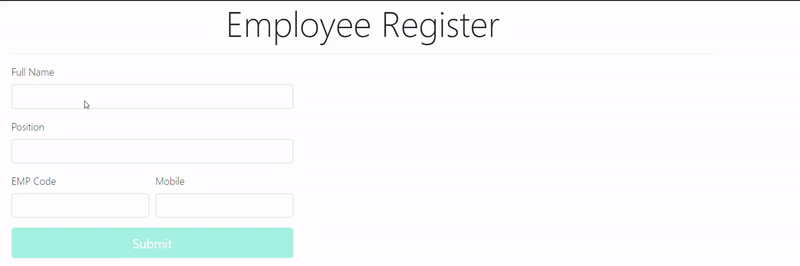

# Aplicação Web feita com Angular e ASP.NET Web API

## Conclusões
* Após esse projeto a estrututra do framework AngularJs ficou mais clara na minha cabeça e passei a ter menos ranço de javascript.
* Typescript é mais tragável do que JS.
* Saudades do meu django :,(
* Saudades do meu Linux :,(

## GIF

	

